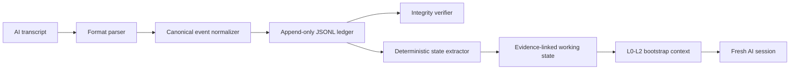

<div align="center">

# Continuum

**Verifiable state transfer for AI work**

[](package.json)
[](LICENSE)
[](package.json)
[](pnpm-workspace.yaml)
[](tsconfig.base.json)
[](#current-capabilities)

</div>

---

Continuum is a local-first context continuity platform for AI-assisted work. It preserves accessible session events in an append-only ledger, derives an evidence-linked working state, and generates layered context that can help a new session continue without starting over.

> [!IMPORTANT]
> Continuum is an early-stage `0.1.0` prototype. The local workspace, project and session model, transcript import, immutable event ledger, integrity checks, deterministic state extraction, and bootstrap generation are implemented. Live capture, portable capsules, retrieval, MCP tools, automated handoff verification, encryption, and the web dashboard are planned but not yet available.

<details>
<summary><strong>Table of contents</strong></summary>

- [Why Continuum?](#why-continuum)
- [Current capabilities](#current-capabilities)
- [How it works](#how-it-works)
- [Requirements](#requirements)
- [Install from source](#install-from-source)
- [Quick start](#quick-start)
- [Supported transcript formats](#supported-transcript-formats)
- [Command reference](#command-reference)
- [Event and integrity model](#event-and-integrity-model)
- [Working state and bootstrap layers](#working-state-and-bootstrap-layers)
- [Local data layout](#local-data-layout)
- [Repository structure](#repository-structure)
- [Development](#development)
- [Product principles](#product-principles)
- [Roadmap](#roadmap)
- [Non-goals](#non-goals)
- [Contributing](#contributing)
- [License](#license)

</details>

## Why Continuum?

AI work is often split across chats, models, tools, and teammates. Conventional summaries are useful, but they can omit exact values, rejected approaches, failure history, constraints, and the evidence behind a decision.

Continuum separates preservation from compression:

- The **event ledger** keeps accessible source events in their original canonical payloads.
- The **working state** extracts objectives, constraints, decisions, next actions, completed work, failures, assumptions, and open questions.
- **Provenance links** connect every extracted statement back to its source event.
- The **bootstrap generator** packages the most useful state into layers for a fresh AI session.
- **Integrity verification** detects malformed, reordered, duplicated, or modified ledger events.

Continuum's use of “complete” or “lossless” is intentionally limited to data the product can access. It does not claim access to hidden chain-of-thought, private system prompts, inaccessible provider state, or identical behavior across models.

## Current capabilities

| Capability | Status | What is available today |
| --- | --- | --- |
| Local workspace | Available | Initializes `~/.continuum` with versioned configuration and local project storage. |
| Projects and sessions | Available | Creates, selects, lists, starts, and closes local project/session records. |
| Transcript import | Available | Imports supported JSON and Markdown transcripts into a newly created session. |
| Canonical events | Available | Defines versioned message, tool, command, artifact, and system event schemas. |
| Immutable ledger | Available | Appends events to per-session JSONL ledgers with ordering, deduplication, and SHA-256 hashes. |
| Ledger verification | Available | Checks JSON, schema, hashes, ordering, duplicate IDs, and project/session consistency. |
| Working-state extraction | Available | Uses deterministic signal-phrase matching to create evidence-linked statements. |
| Layered bootstrap | Available | Generates L0 orientation, L1 active state, and L2 governing context. |
| Live session capture | Planned | `session start` currently creates session metadata; it does not capture a running AI client. |
| Capsules and retrieval | Planned | Portable export/import, exact search, semantic search, artifact storage, and task-aware loading. |
| MCP server | Planned | The `@continuum/mcp` package is currently a placeholder. |
| Transfer verification | Planned | Evaluation, scoring, contradiction detection, targeted repair, and readiness reports. |
| Web dashboard | Planned | The `@continuum/web` package is currently a placeholder. |

## How it works



The ledger is the source of truth. Working state and bootstrap text are derived artifacts that can be regenerated from recorded events.

## Requirements

- Node.js 18 or newer
- [pnpm](https://pnpm.io/)
- Git

The repository includes TypeScript, Vitest, ESLint, Prettier, and `tsx` as development dependencies.

## Install from source

Continuum is not currently published as a stable package. Run it from the monorepo:

```bash
git clone https://github.com/dhruv-techdev/continuum.git
cd continuum
pnpm install
pnpm build
```

During development, invoke the CLI with:

```bash
pnpm --silent dev:cli --help
```

All examples below use `pnpm --silent dev:cli` as the command prefix. If you link or install the CLI binary yourself, replace that prefix with `continuum`.

## Quick start

### 1. Initialize the local workspace

```bash
pnpm --silent dev:cli init
pnpm --silent dev:cli doctor
```

By default, Continuum stores its data under `~/.continuum`. Most commands also accept `--root <path>` when you need an isolated workspace.

### 2. Create a project

```bash
pnpm --silent dev:cli project create \
  --title "Continuum README" \
  --description "Document the local CLI prototype"
```

The new project is selected automatically.

### 3. Import a transcript

```bash
pnpm --silent dev:cli import ./conversation.json \
  --provider openai \
  --model gpt-4.1
```

An import creates a new session, makes it active, normalizes each supported message into a canonical event, and appends the events to that session's ledger.

### 4. Verify the ledger

```bash
pnpm --silent dev:cli verify-ledger
```

To verify every session in the active project:

```bash
pnpm --silent dev:cli verify-ledger --all
```

### 5. Inspect the working state

```bash
pnpm --silent dev:cli state show --refresh
```

`--refresh` regenerates `working-state.json` from the current ledgers. Without it, Continuum uses the cached state when one exists.

### 6. Generate context for a fresh session

```bash
pnpm --silent dev:cli state bootstrap --refresh > continuum-context.md
```

Paste the generated Markdown into a new AI session as orientation context. Automated injection and receiving-agent verification are roadmap features.

## Supported transcript formats

### JSON

Continuum accepts a direct message array:

```json
[
  {
    "role": "user",
    "content": "I want to preserve the state of this project."
  },
  {
    "role": "assistant",
    "content": "Let's use an append-only event ledger."
  }
]
```

It also recognizes arrays stored under `messages`, `conversation`, `chat`, `data`, or `turns`:

```json
{
  "messages": [
    { "role": "user", "content": "What is the next step?" },
    { "role": "assistant", "content": "Verify the imported ledger." }
  ]
}
```

ChatGPT-style exports that contain a `mapping` object are detected and ordered by `create_time`. Message-level fields that are readable but do not map to the canonical schema are retained under event metadata and reported as import warnings.

### Markdown

The Markdown parser recognizes common role markers, including:

```markdown
## User
I need to continue this work in a new session.

## Assistant
First, preserve the objective, constraints, decisions, and failures.
```

It also supports `**User:**`, `**Assistant:**`, `User:`, `Assistant:`, `Human:`, and aliases such as `Me:`, `AI:`, `ChatGPT:`, and `Claude:`.

Use `--verbose` during import to show all parsing and normalization warnings:

```bash
pnpm --silent dev:cli import ./conversation.md --verbose
```

## Command reference

| Command | Purpose | Useful options |
| --- | --- | --- |
| `init` | Initialize the local workspace. | `--root <path>`, `--force` |
| `doctor` | Check Node.js, pnpm, TypeScript, the data directory, and the default workspace configuration. | None |
| `project create` | Create and automatically select a project. | `--title <title>`, `--description <text>`, `--root <path>` |
| `project list` | List projects and mark the active one. | `--root <path>` |
| `project select <id>` | Select an existing project and clear the active session selection. | `--root <path>` |
| `session start` | Create and activate an empty session record. | `--provider <name>`, `--model <name>`, `--root <path>` |
| `session list` | List sessions in the active project. | `--root <path>` |
| `session close [id]` | Close a named session or the active session. | `--root <path>` |
| `import <file>` | Import a JSON or Markdown transcript into a new active session. | `--provider <name>`, `--model <name>`, `--verbose`, `--root <path>` |
| `verify-ledger` | Verify the active, selected, or all session ledgers. | `--session <id>`, `--all`, `--verbose`, `--root <path>` |
| `state show` | Display cached or freshly extracted project state with provenance. | `--refresh`, `--root <path>` |
| `state bootstrap` | Print layered Markdown context for a fresh session. | `--refresh`, `--root <path>` |

Run any command with `--help` for its full usage:

```bash
pnpm --silent dev:cli import --help
```

## Event and integrity model

Each canonical event includes:

- `id`: unique `evt_<uuid>` identifier
- `type`: message, tool call/result, command/output, artifact, or system event
- `projectId` and `sessionId`
- UTC `timestamp`
- monotonically increasing per-session `sequence`
- independent event `schemaVersion`
- adapter or import `source`
- typed `payload`
- SHA-256 `hash`

The hash covers the event type, project ID, session ID, sequence, timestamp, source, and payload using recursively key-sorted canonical JSON. The generated event ID and the hash field itself are excluded.

On append, the ledger rejects duplicate IDs, non-increasing sequences, invalid hashes, and write failures. `verify-ledger` performs a full audit for:

- invalid JSON lines
- schema violations
- payload or metadata modification
- non-increasing event sequences
- duplicate event IDs
- inconsistent project or session IDs within one ledger

An integrity pass proves that the stored ledger is internally consistent. It does not yet prove that an external provider exposed every event or that the receiving AI reconstructed the project correctly.

## Working state and bootstrap layers

The current extractor is deterministic and heuristic. It scans message sentences for signal phrases, assigns a confidence level, and links each result to its source event ID.

Extracted categories are:

- objectives
- constraints and prohibitions
- decisions
- next actions
- completed work
- failed approaches
- assumptions
- open questions

The bootstrap generator arranges these statements into three layers:

| Layer | Contents |
| --- | --- |
| L0 — Orientation | Project title, description, session/event counts, and primary objective. |
| L1 — Active state | Objectives, completed work, next actions, and open questions. |
| L2 — Governing context | Constraints, decisions, failed approaches, and assumptions. |

This is an intentionally minimal first implementation. It does not yet resolve contradictions, track superseded statements, apply a token budget, retrieve L3 evidence, or verify the receiving agent's understanding.

## Local data layout

```text
~/.continuum/
├── config.json
├── state.json
├── capsules/                         # reserved for portable capsules
├── logs/                             # reserved for operational logs
└── projects/
    └── proj_<uuid>/
        ├── project.json
        ├── working-state.json         # regenerable cache
        └── sessions/
            └── sess_<uuid>/
                ├── session.json
                └── events.jsonl       # append-only source ledger
```

`config.json` currently records storage, capture, and privacy preferences. The defaults are local-only storage, SHA-256 hashing, common secret-file exclusion patterns, and secret detection enabled. Automatic exclusion, secret detection, redaction, encryption, retention, and policy enforcement are not implemented yet; do not treat the present configuration flags as active security controls.

## Repository structure

```text
continuum/
├── packages/
│   ├── core/     # event schemas, ledger, import, projects, sessions, and state engine
│   ├── cli/      # Commander-based developer CLI
│   ├── mcp/      # planned MCP server; placeholder package today
│   └── web/      # planned dashboard; placeholder package today
├── package.json
├── pnpm-workspace.yaml
└── vitest.config.ts
```

## Development

```bash
# Run all tests
pnpm test

# Run tests in watch mode
pnpm test:watch

# Build every workspace package
pnpm build

# Type-check through the project references
pnpm exec tsc --build

# Lint TypeScript sources
pnpm lint

# Check formatting
pnpm format:check

# Apply formatting
pnpm format
```

To run the compiled CLI after `pnpm build`:

```bash
node packages/cli/dist/index.js --help
```

## Product principles

- **Preserve before compressing.** The source ledger is authoritative; derived state can be regenerated.
- **Evidence over confident recall.** Derived claims should point to source events.
- **Layer context.** Orientation, active state, governing context, evidence, and the full archive serve different needs.
- **Verify continuity.** The long-term transfer standard is demonstrated understanding, not assumed recall.
- **Make boundaries explicit.** Capture coverage, redaction, retention, sharing, and inaccessible data should be visible.
- **Stay provider-neutral.** The canonical model should not depend on one vendor's chat format.
- **Earn local-first trust.** Sensitive context should remain under the user's control by default.

## Roadmap

- [x] Monorepo and CLI foundation
- [x] Local workspace configuration
- [x] Projects and sessions
- [x] Canonical event schema
- [x] JSON and Markdown transcript import
- [x] Append-only JSONL event ledger
- [x] Ledger integrity verification
- [x] Evidence-linked deterministic working state
- [x] L0-L2 bootstrap generation
- [ ] Live capture adapters and explicit coverage reports
- [ ] Portable, versioned capsule export and import
- [ ] Exact, semantic, temporal, entity, artifact, and source-ID retrieval
- [ ] Task-aware context planning with token budgets
- [ ] Local MCP server and agent-callable context tools
- [ ] Transfer checks, scoring, targeted repair, and readiness reports
- [ ] Artifact storage and relationship indexing
- [ ] Enforced exclusions, secret detection, redaction, encryption, and retention
- [ ] Local web dashboard
- [ ] Optional encrypted synchronization and team workflows

## Non-goals

Continuum is not intended to:

- capture hidden model reasoning or inaccessible provider internals
- guarantee identical outputs across different models
- replace source control, document storage, or knowledge-management systems
- restore arbitrary operating-system or process state
- share private context without explicit authorization

## Contributing

Contributions are welcome while the product and capsule model are still evolving.

1. Create a focused branch.
2. Add or update tests with behavior changes.
3. Run `pnpm test`, `pnpm build`, `pnpm lint`, and `pnpm format:check`.
4. Open a pull request that explains the user-visible behavior and any schema or compatibility impact.

When changing event formats, keep the event schema version independent from the package version and treat breaking schema changes explicitly.

## License

Continuum is licensed under the [Apache License 2.0](LICENSE).

---

**North star:** A change of session, model, tool, teammate, or agent should never force valuable work to begin again.
